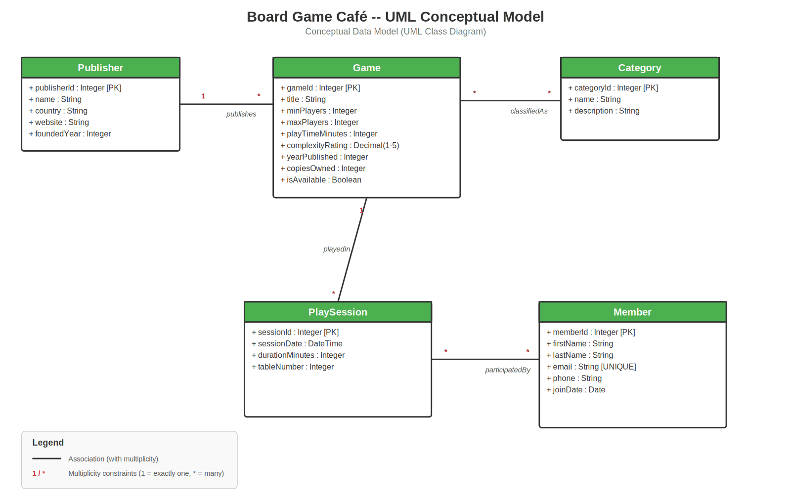
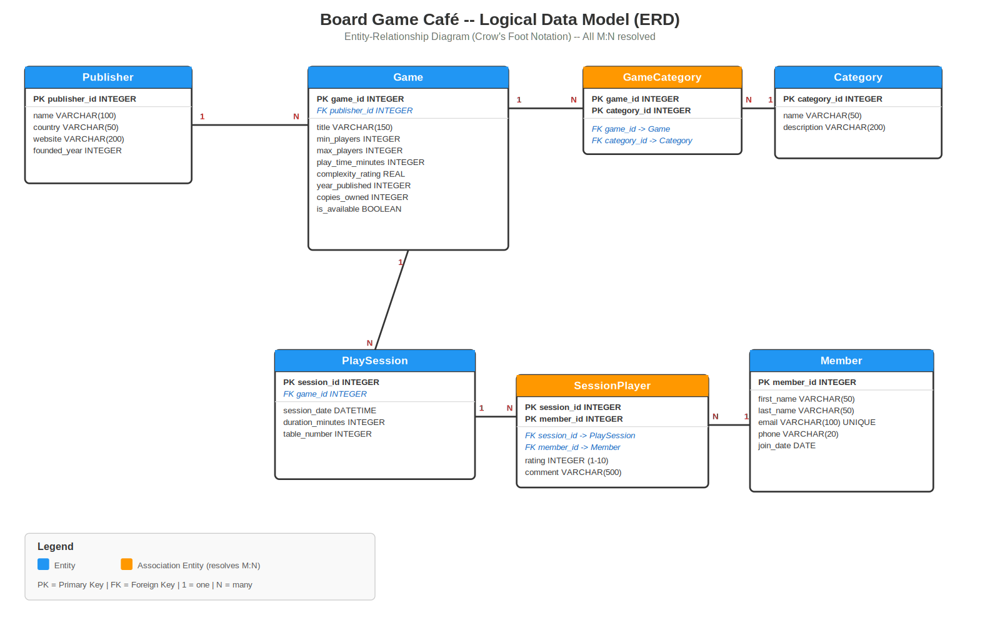

# Board Game Café Database

A complete database design and implementation for **The Meeple Lounge**, a board game café that tracks its game library, membership base, and play sessions.

---

## Quick Start

```bash
# 1. Create and populate the database
bash setup.sh

# 2. Run any query
sqlite3 -header -column boardgame_cafe.db < sql/queries/query1_three_table_join.sql

# 3. Start the web application (optional, for bonus points)
cd app
npm install
node app.js
# Open http://localhost:3000
```

---

## Repository Structure

```
boardgame-cafe-db/
├── README.md                  ← This file
├── .gitignore
├── setup.sh                   ← Creates the database from SQL scripts
│
├── docs/
│   ├── requirements.pdf       ← [Point 1] Requirements document
│   ├── bcnf_schema.pdf        ← [Point 4] Relational schema + BCNF proof
│   └── query_outputs.txt      ← [Point 7] Example outputs of all queries
│
├── diagrams/
│   ├── uml_conceptual_model.png  ← [Point 2] UML Class Diagram
│   └── erd_logical_model.png     ← [Point 3] ERD (Crow's Foot notation)
│
├── sql/
│   ├── create_tables.sql      ← [Point 5] DDL statements
│   ├── populate_data.sql      ← [Point 6] Test data
│   └── queries/
│       ├── query1_three_table_join.sql  ← [Point 7] Join of 4 tables
│       ├── query2_subquery.sql          ← [Point 7] Subquery
│       ├── query3_group_by_having.sql   ← [Point 7] GROUP BY + HAVING
│       ├── query4_complex_search.sql    ← [Point 7] Complex search criterion
│       └── query5_advanced.sql          ← [Point 7] RCTE, PARTITION BY, CASE/WHEN
│
└── app/                       ← [Point 8] Node + Express CRUD application
    ├── package.json
    ├── app.js
    └── views/
        ├── index.ejs
        ├── partials/
        ├── publishers/
        └── games/
```

---

## Assignment Deliverables

### Point 1 — Requirements Document (10 pts)

**File:** [`docs/requirements.pdf`](docs/requirements.pdf)

Describes the Meeple Lounge business domain, lists 10 business rules, and extracts candidate nouns (entities/attributes) and actions (relationships) from those rules.

### Point 2 — UML Conceptual Model (15 pts)

**File:** [`diagrams/uml_conceptual_model.png`](diagrams/uml_conceptual_model.png)



Five classes with full multiplicity constraints and typed attributes:
- **1:N** — Publisher publishes Games
- **M:N** — Game is classified into Categories
- **M:N** — Members participate in PlaySessions
- **N:1** — PlaySession is for one Game

### Point 3 — Logical Data Model / ERD (10 pts)

**File:** [`diagrams/erd_logical_model.png`](diagrams/erd_logical_model.png)



Uses Crow's Foot notation. All M:N relationships resolved into association entities:
- **GameCategory** resolves Game ↔ Category
- **SessionPlayer** resolves PlaySession ↔ Member (carries `rating` and `comment` attributes)

> **Note:** This ERD was generated programmatically. To recreate in LucidChart, import the entities and relationships shown above.

### Point 4 — Relational Schema in BCNF (15 pts)

**File:** [`docs/bcnf_schema.pdf`](docs/bcnf_schema.pdf)

Seven relations, each proven to be in BCNF by listing functional dependencies and verifying every determinant is a superkey:

| # | Relation | Key | Non-trivial FDs | BCNF? |
|---|----------|-----|-----------------|-------|
| 1 | Publisher | {publisher_id} | publisher_id → all others | ✓ |
| 2 | Game | {game_id} | game_id → all others | ✓ |
| 3 | Category | {category_id}, {name} | Both CKs → all others | ✓ |
| 4 | GameCategory | {game_id, category_id} | All-key (no non-trivial FDs) | ✓ |
| 5 | Member | {member_id}, {email} | Both CKs → all others | ✓ |
| 6 | PlaySession | {session_id} | session_id → all others | ✓ |
| 7 | SessionPlayer | {session_id, member_id} | Composite key → rating, comment | ✓ |

### Point 5 — SQL DDL (10 pts)

**File:** [`sql/create_tables.sql`](sql/create_tables.sql)

Creates all 7 tables with:
- Primary keys (AUTOINCREMENT where appropriate)
- Foreign keys with ON DELETE/UPDATE actions
- CHECK constraints (e.g., `max_players >= min_players`, `rating BETWEEN 1 AND 10`, `complexity_rating BETWEEN 1.0 AND 5.0`)
- UNIQUE constraints (`Member.email`, `Category.name`)
- Indexes on frequently queried columns

Constraint enforcement verified:

| Test | Expected | Result |
|------|----------|--------|
| `min_players > max_players` | CHECK fails | ✓ Rejected |
| `rating = 15` (outside 1–10) | CHECK fails | ✓ Rejected |
| Duplicate `email` | UNIQUE fails | ✓ Rejected |
| Non-existent `publisher_id` | FK fails | ✓ Rejected |

### Point 6 — Test Data (10 pts)

**File:** [`sql/populate_data.sql`](sql/populate_data.sql)

| Table | Records | Notes |
|-------|---------|-------|
| Publisher | 8 | Real board game publishers |
| Category | 8 | Strategy, Cooperative, Party, etc. |
| Game | 15 | Real board game titles |
| GameCategory | 35 | Multi-category assignments |
| Member | 12 | Fictional members |
| PlaySession | 20 | Spanning Sept 2024 |
| SessionPlayer | 59 | With ratings (1–10) and comments |

### Point 7 — Queries (10 pts)

All queries and their outputs are documented in [`docs/query_outputs.txt`](docs/query_outputs.txt).

| Query | Requirement | File | Description |
|-------|-------------|------|-------------|
| 1 | Join of ≥3 tables | [`query1_three_table_join.sql`](sql/queries/query1_three_table_join.sql) | Games with publisher name, country, and average player rating (joins Game → Publisher → PlaySession → SessionPlayer) |
| 2 | Subquery | [`query2_subquery.sql`](sql/queries/query2_subquery.sql) | Members who played games with above-average complexity (subquery computes AVG in WHERE) |
| 3 | GROUP BY + HAVING | [`query3_group_by_having.sql`](sql/queries/query3_group_by_having.sql) | Categories where average rating ≥ 8.0 with at least 3 ratings |
| 4 | Complex search | [`query4_complex_search.sql`](sql/queries/query4_complex_search.sql) | "Date night" game finder: 6 AND conditions, BETWEEN, IN with subquery, comparison operators |
| 5 | Advanced mechanisms | [`query5_advanced.sql`](sql/queries/query5_advanced.sql) | (A) RANK() with PARTITION BY publisher + CASE/WHEN complexity classifier; (B) Recursive CTE for member engagement tiers |

### Point 8 — Node + Express Application (20 bonus pts)

**Directory:** [`app/`](app/)

Full CRUD for two related tables: **Publisher** (parent) and **Game** (child, FK `publisher_id`).

**Stack:** Node.js, Express 4, EJS templates, sql.js (pure-JS SQLite driver)

**Features:**
- **Create** — Forms with validation, publisher dropdown for games
- **Read** — Sortable list views with all attributes displayed
- **Update** — Pre-populated edit forms
- **Delete** — Confirmation dialogs; FK constraint prevents deleting publishers that still have games
- Home dashboard showing record counts for all tables
- SQLite CHECK constraint errors surfaced in the UI

**To run:**
```bash
bash setup.sh          # creates the database
cd app
npm install            # installs Express, EJS, sql.js
node app.js            # starts at http://localhost:3000
```

> **Note on SQLite driver:** This app uses `sql.js` (pure JavaScript, no native compilation required). If you prefer `better-sqlite3` (used in the professor's reference repos), install it and change the DB initialization in `app.js` — the SQL statements are identical.

---

## Schema Overview

```
Publisher  1 ──────< N  Game  1 ──────< N  GameCategory  N >────── 1  Category
                         │
                         1
                         │
                         N
                    PlaySession  1 ──────< N  SessionPlayer  N >────── 1  Member
```

---

## How to Run Queries Individually

```bash
# Make sure database exists
bash setup.sh

# Run any query with formatted output
sqlite3 -header -column boardgame_cafe.db < sql/queries/query1_three_table_join.sql
sqlite3 -header -column boardgame_cafe.db < sql/queries/query2_subquery.sql
sqlite3 -header -column boardgame_cafe.db < sql/queries/query3_group_by_having.sql
sqlite3 -header -column boardgame_cafe.db < sql/queries/query4_complex_search.sql
sqlite3 -header -column boardgame_cafe.db < sql/queries/query5_advanced.sql
```
